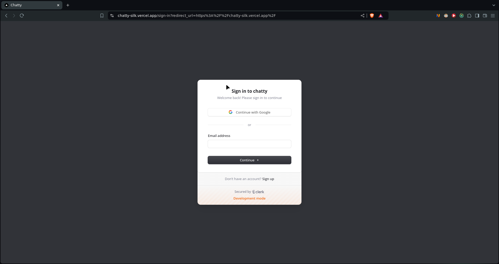
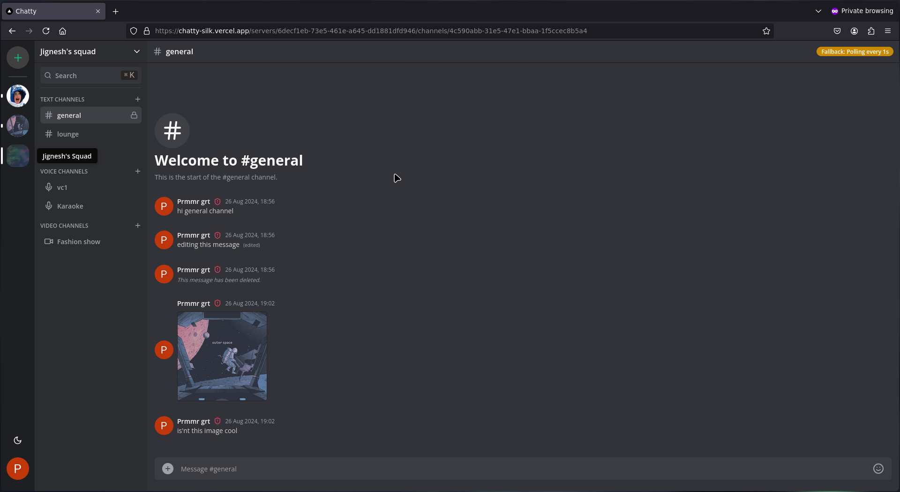
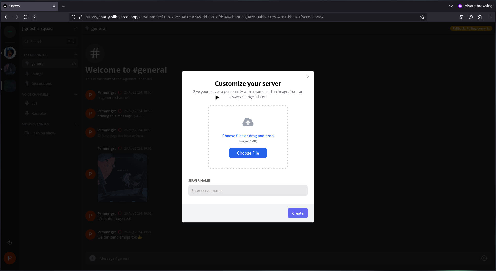
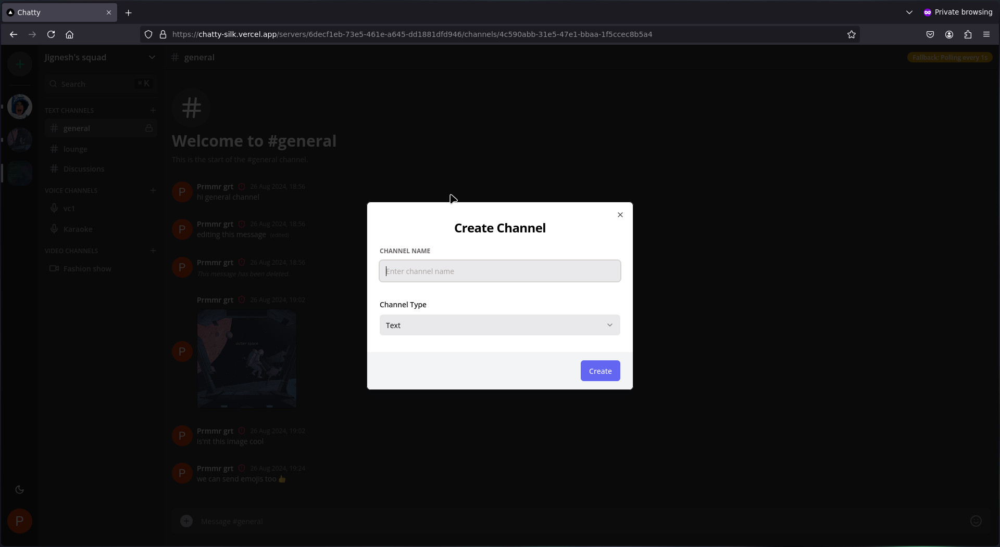
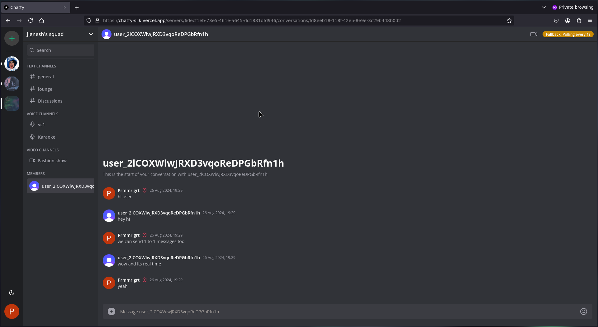
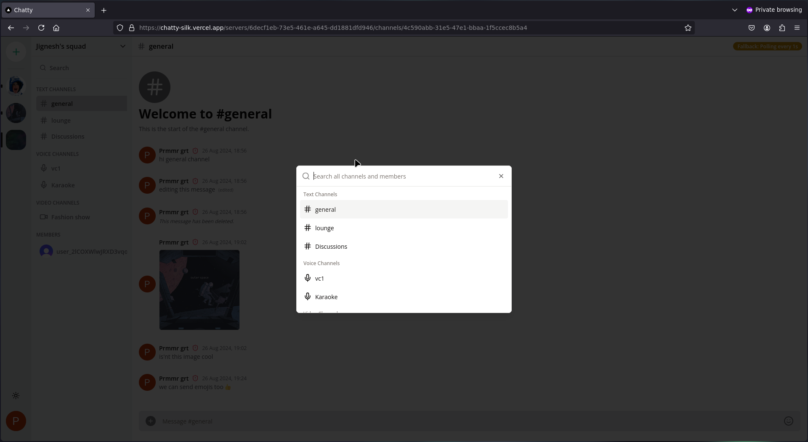
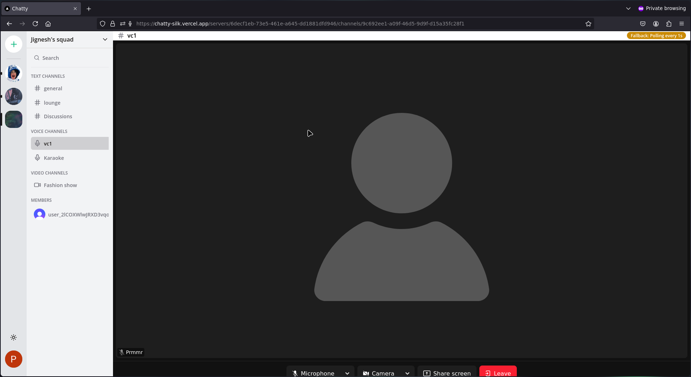
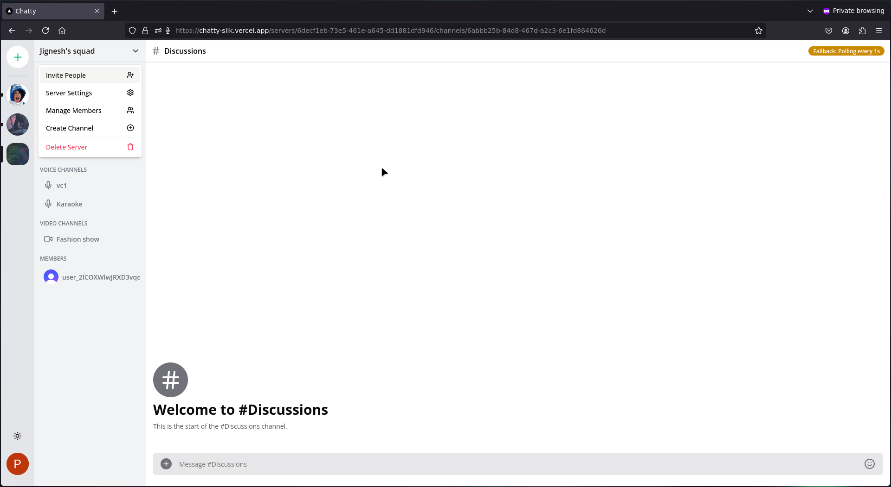
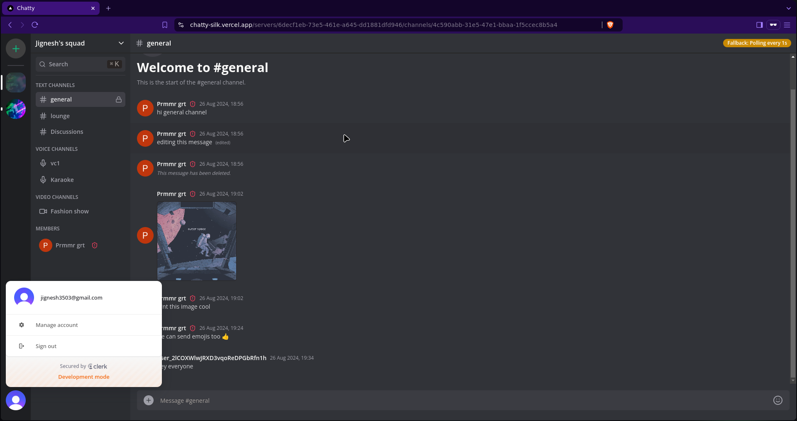

# Chatty

Chatty is a Discord clone built with modern web technologies, offering real-time messaging, server creation, and member management. It provides a seamless and responsive UI for text, audio, and video communication, complete with light and dark modes.

## Features

- **Tech Stack:**

  - **Frontend:** Next.js 14, React, TailwindCSS, ShadcnUI
  - **Backend:** Node.js, Socket.io, Prisma
  - **Database:** PostgreSQL (NeonDb)
  - **TypeScript:** Strict type-checking throughout the project

- **Core Features:**

  - **Authentication:** Secure authentication using Clerk
  - **Messaging:** Real-time messaging with Socket.io, including sending attachments via UploadThing
  - **Message Management:** Edit and delete messages in real-time across all users
  - **Communication Channels:** Create text, audio, and video call channels
  - **1:1 Conversations:** Private messaging and video calls between members
  - **Member Management:** Assign roles (Guest/Moderator), kick members, and manage servers
  - **Invite System:** Generate unique invite links with a fully functional invite system
  - **Infinite Scrolling:** Load messages in batches of 10 using TanStack Query
  - **Server Customization:** Create and customize your own servers
  - **Light/Dark Mode:** Beautiful UI with support for both light and dark themes

- **Additional Features:**
  - **Form Validation:** Client-side form validation with react-hook-form and zod
  - **API Handling:** POST, DELETE, and GET routes implemented in route handlers
  - **WebSocket Fallback:** Automatic fallback to polling with alerts in case of WebSocket failure
  - **ORM:** Prisma for database operations
  - **Database:** PostgreSQL database hosted on NeonDb

## Installation

1. **Clone the Repository:**

   ```bash
   git clone https://github.com/jignesh119/chatty.git
   cd chatty
   ```

2. **Install Dependencies:**

   ```bash
   npm install
   ```

3. **Set Up Environment Variables:**

   Create a `.env` file in the root directory and configure the following variables:

   ```bash
   NEXT_PUBLIC_CLERK_PUBLISHABLE_KEY=your_clerk_publishable_key
   CLERK_SECRET_KEY=your_clerk_secret_key
   NEXT_PUBLIC_CLERK_SIGN_IN_URL=/sign-in
   NEXT_PUBLIC_CLERK_SIGN_UP_URL=/sign-up
   DATABASE_URL=your_postgresql_database_url
   UPLOADTHING_SECRET=your_uploadthing_secret
   UPLOADTHING_APP_ID=your_uploadthing_app_id
   LIVEKIT_API_KEY=your_livekit_api_key
   LIVEKIT_API_SECRET=your_livekit_api_secret
   NEXT_PUBLIC_LIVEKIT_URL=your_livekit_url
   ```

4. **Run Migrations:**

   ```bash
   npx prisma migrate dev
   ```

5. **Start the Development Server:**

   ```bash
   npm run dev
   ```

   The application will be available at `http://localhost:3000`.

## Usage

- **Create an Account:** Sign up using the Clerk authentication system.
- **Join or Create a Server:** Create your own server or join an existing one using an invite link.
- **Start Messaging:** Begin real-time communication with text, audio, and video messages.
- **Manage Members:** Use the member management features to assign roles, kick members, and manage your server.
- **Customize:** Switch between light and dark mode and customize your server.

## Contributing

Contributions are welcome! Please follow these steps:

1. Fork the repository.
2. Create a new branch: `git checkout -b feature-branch-name`.
3. Make your changes and commit them: `git commit -m 'Add some feature'`.
4. Push to the branch: `git push origin feature-branch-name`.
5. Submit a pull request.

## Demo










